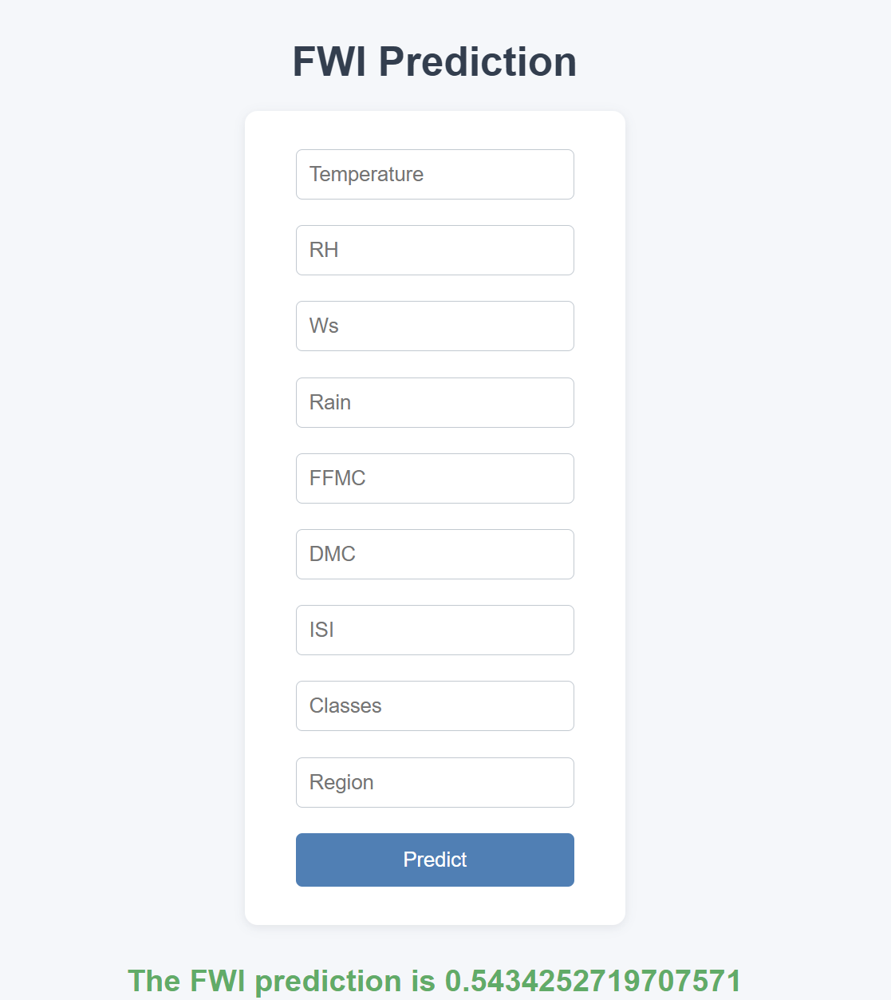

# 🔥 Forest Fire Area Prediction

[](https://testforestfires-dyi0.onrender.com/predict_data)
[](https://www.python.org/)
[](https://flask.palletsprojects.com/)


---

## 🌱 About the Project

**Forest Fire Area Prediction** is a machine learning web application that predicts the **area affected by a forest fire** based on several environmental and regional parameters.

### R2 Score :  0.9842993364555512

🔗 **Live App**: [Click Here to Use the Application](https://fwi-calculator-algerian-forest-2.onrender.com)

## 🎯 Real-World Use Case

Forest fires are becoming more frequent due to climate change. Early prediction of the **scale of destruction** helps stakeholders take preventive actions. This system:

- 📈 Predicts **how much area might burn** under specific weather conditions.
- ⚠️ Aims to **assist forest departments, environmental agencies**, and **disaster response units**.
- 🌱 Helps preserve **biodiversity**, **forests**, and **minimize CO₂ emissions**.

## 🖼 Screenshots
<!-- Upload your screenshots to GitHub and paste the image URLs below --> 

---

## 🚀 Tech Stack

- 🐍 Python 3.8+
- 🌐 Flask (Web Framework)
- 🤖 Scikit-learn (Machine Learning)
- 📦 Pickle for model storage
- 🧪 Ridge Regression
- 🖥️ HTML (Jinja templates)

---

## 🧠 How It Works

1. User inputs weather and fire parameters in the web form.
2. Data is normalized using `StandardScaler`.
3. A trained Ridge Regression model predicts the affected area.
4. The result is displayed on a separate webpage.

---

## 🔍 Interpreting FWI Values

| **FWI Value**   | **Fire Danger Level** | **Meaning** |
|-----------------|------------------------|-------------|
| 0.0 – 5.0       | 🔵 **Low**              | Fires are unlikely or easily controlled. |
| 5.1 – 12.0      | 🟡 **Moderate**         | Fires may start and require attention. |
| 12.1 – 30.0     | 🟠 **High**             | Fires spread quickly and require active suppression. |
| 30.1 – 50.0     | 🔴 **Very High**        | Fires ignite easily, spread rapidly. |
| > 50.0          | ⚫ **Extreme**           | Explosive fire behavior; immediate emergency action needed. |

---

## 📥 Input Parameters

| Feature    | Description                        |
|------------|------------------------------------|
| Temperature| Ambient temperature in °C          |
| RH         | Relative Humidity (%)              |
| Ws         | Wind speed (km/h)                  |
| Rain       | Rainfall amount                    |
| FFMC       | Fine Fuel Moisture Code            |
| DMC        | Duff Moisture Code                 |
| ISI        | Initial Spread Index               |
| Classes    | Fire severity class (encoded)      |
| Region     | Encoded region number              |

---

## 📦 Setup Instructions

> To run this project locally:

```bash
# 1. Clone the repo
git clone https://github.com/mayank-kumar03/FWI_calculator_algerian_forest
cd testforestfires

# 2. (Optional) Create virtual environment
python -m venv venv
source venv/bin/activate  # On Windows: venv\Scripts\activate

# 3. Install dependencies
pip install -r requirements.txt

# 4. Run the app
python application.py

# Visit http://localhost:8000 or http://127.0.0.1:8000 in your browser
```

## 🗂 Project Structure
```
├── application.py        # Main Flask app
├── models/
│   ├── ridge.pkl         # Trained ML model
│   └── scaler.pkl        # Scaler object
├── templates/
│   ├── index.html        # Input form
│   └── home.html         # Output page
├── datasets/             # Optional: dataset files
├── requirements.txt      # Dependencies
└── README.md             # You're here!
```

## 👨‍💻 Author
Made with ❤️ by Mayank Kumar

Feel free to fork, contribute, or connect with me on GitHub!

## ⭐ Give It a Star
If you like this project, please consider giving it a ⭐ on GitHub — it really helps!
